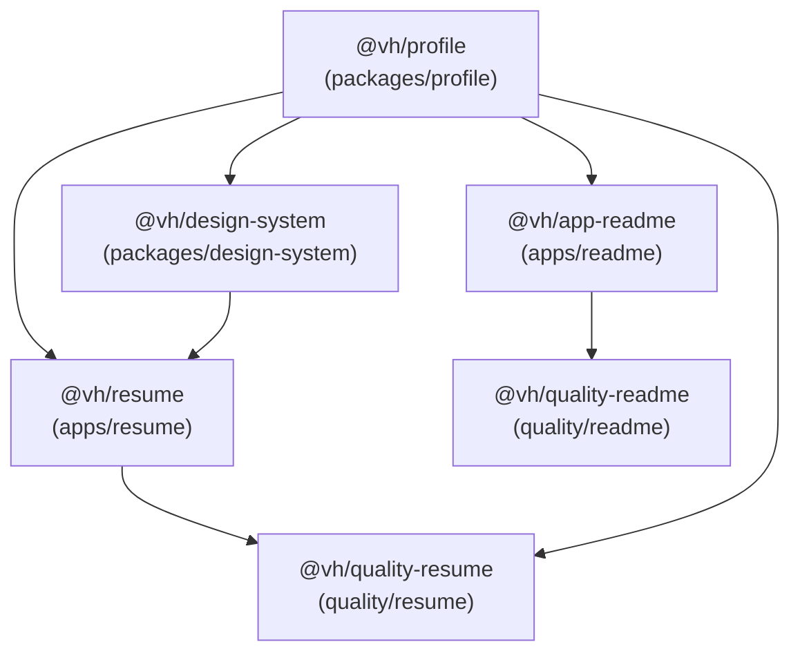

# Developer Guide

Central developer reference for the `virgenherrera` pnpm monorepo. Per-workspace READMEs link back here for shared tooling, conventions, and pipeline documentation.

## Menú

- [Prerequisites](#prerequisites)
- [Quick Start](#quick-start)
- [Workspace Map](#workspace-map)
- [Dependency Graph](#dependency-graph)
- [Root Scripts](#root-scripts)
- [Quality Gates](#quality-gates)
- [Branching Model](#branching-model)
- [CI/CD Pipeline](#cicd-pipeline)
- [Commit Convention](#commit-convention)

---

## Prerequisites

Check the `engines` field in [`package.json`](package.json) for the required Node.js and pnpm versions.

[↑ Menú](#menú)

---

## Quick Start

```bash
git clone https://github.com/virgenherrera/virgenherrera.git
cd virgenherrera
pnpm install
pnpm run serve:resume
```

The resume app starts on `http://localhost:4200` by default.

To launch the design-system component explorer instead:

```bash
pnpm run storybook
```

[↑ Menú](#menú)

---

## Workspace Map

| Name                 | Path                      | Description                                                           | README                                                               |
| -------------------- | ------------------------- | --------------------------------------------------------------------- | -------------------------------------------------------------------- |
| `@vh/resume`         | `apps/resume/`            | Angular 22 SSR resume application — deployed to GitHub Pages          | [apps/resume/README.md](apps/resume/README.md)                       |
| `@vh/app-readme`     | `apps/readme/`            | NestJS script that generates the root `README.md` from the GitHub API | [apps/readme/README.md](apps/readme/README.md)                       |
| `@vh/profile`        | `packages/profile/`       | TypeScript data library — profile schemas, types, and raw data        | [packages/profile/README.md](packages/profile/README.md)             |
| `@vh/design-system`  | `packages/design-system/` | Angular 22 component library with Storybook                           | [packages/design-system/README.md](packages/design-system/README.md) |
| `@vh/quality-resume` | `quality/resume/`         | Playwright e2e test suite for `apps/resume`                           | [quality/resume/README.md](quality/resume/README.md)                 |
| `@vh/quality-readme` | `quality/readme/`         | Jest integration test suite for `apps/readme`                         | [quality/readme/README.md](quality/readme/README.md)                 |

[↑ Menú](#menú)

---

## Dependency Graph



`packages/profile` is the foundation — every other workspace depends on it directly or transitively.

[↑ Menú](#menú)

---

## Root Scripts

| Script             | Description                                                                        |
| ------------------ | ---------------------------------------------------------------------------------- |
| `serve:resume`     | Start the `apps/resume` Angular dev server                                         |
| `storybook`        | Start the `packages/design-system` Storybook dev server                            |
| `build`            | Build all workspaces that expose a `build` script (recursive)                      |
| `build:storybook`  | Build the Storybook static site for `packages/design-system`                       |
| `generate:readme`  | Run `apps/readme` to regenerate the root `README.md`                               |
| `test`             | Full pipeline: `cleanup` → `build` → `test:static` → `test:types` → `test:dynamic` |
| `test:doctor`      | Dependency-bump validation gate — runs per-workspace `test:doctor` (used by NCU)   |
| `test:static`      | Lint and formatting checks across all workspaces (recursive)                       |
| `test:types`       | TypeScript type checks across all workspaces (recursive)                           |
| `test:unit`        | Unit tests across all workspaces (recursive)                                       |
| `test:e2e`         | End-to-end tests across all workspaces (recursive)                                 |
| `test:dynamic`     | Composite: `test:unit` → `test:e2e`                                                |
| `eslintFix`        | Fix ESLint issues (accepts file globs as trailing args)                            |
| `prettierFix`      | Fix Prettier formatting (accepts file globs as trailing args)                      |
| `lintStaged`       | Run lint-staged — called by the pre-commit hook                                    |
| `prepare`          | Install Husky git hooks (runs automatically on `pnpm install`)                     |
| `securityCheck`    | Audit dependencies for high-severity CVEs (`pnpm audit --audit-level high`)        |
| `securityFix`      | Update dependencies to resolve CVEs (`pnpm update`)                                |
| `updatePnpm`       | Upgrade pnpm to the latest version via `corepack up`                               |
| `cleanup`          | Remove all build artifacts from all workspaces and `artifacts/` directory          |
| `bumpDependencies` | Safely upgrade all dependencies: `securityFix` → NCU doctor → `securityFix`        |

[↑ Menú](#menú)

---

## Quality Gates

Every atomic script defined in `package.json` is reused under the **identical name** across all execution contexts: local development, lint-staged, pre-commit, pre-push, CI, and dependency bumps. No per-context aliases. No inline tool invocations. Root scripts delegate to workspaces via `pnpm -r run --if-present <name>` — workspaces opt in by exposing the matching script.

This is the **Echo Principle**: if a script's command changes in any workspace, every context inherits that change automatically without touching hook files or CI workflows.

See [docs/quality-gates.md](docs/quality-gates.md) for the full script taxonomy, workspace echo matrix, pipeline order contract, tier split rationale, and pipeline diagrams.

[↑ Menú](#menú)

---

## Branching Model

```mermaid
gitGraph
    commit id: "master"
    branch feature/epic
    checkout feature/epic
    branch task/name
    checkout task/name
    commit id: "work"
    checkout feature/epic
    merge task/name id: "merge task"
    checkout master
    merge feature/epic id: "PR merged"
```

| Branch type      | Pattern               | Purpose                                    |
| ---------------- | --------------------- | ------------------------------------------ |
| Task branch      | `task/{name}`         | One per agent or work unit — smallest unit |
| Epic branch      | `feature/{epic-name}` | Collects all task merges for a feature     |
| Integration → PR | feature → master      | Squash-merge via pull request              |

There is no "too small" exemption. A one-line fix follows the same branching model as a 50-file epic. The model exists for auditability and rollback safety.

See [AGENTS.md](AGENTS.md) for the full branching protocol, handoff requirements, and anti-rationalization rules.

[↑ Menú](#menú)

---

## CI/CD Pipeline

### Continuous Integration (pull requests)

Triggered on every pull request targeting `master`. Path filters detect which workspaces changed and skip unnecessary jobs.


`test:static` and `test:types` always run regardless of path filters.

### Continuous Deployment (push to master)

Triggered on every push to `master`. All jobs run after the build completes.


`tag`, `deploy-resume`, and `deploy-readme` run in parallel after `build` succeeds. The `deploy-readme` job commits the regenerated `README.md` back to `master` with `[skip ci]` to prevent a pipeline loop.

[↑ Menú](#menú)

---

## Commit Convention

Every commit follows [Conventional Commits](https://www.conventionalcommits.org/).

```text
<type>: imperative summary, lowercase, no period, max 72 chars

Brief description of why.

- Concrete change 1.
- Concrete change n.
```

| Type    | When to use                       |
| ------- | --------------------------------- |
| `feat`  | New features or capabilities      |
| `fix`   | Bug fixes                         |
| `chore` | Tooling, config, dependencies, CI |
| `task`  | Changes to existing functionality |
| `spike` | Research or exploration           |

No `Co-Authored-By` or AI attribution lines. See [AGENTS.md](AGENTS.md) for the full commit convention and agent rules.

[↑ Menú](#menú)
