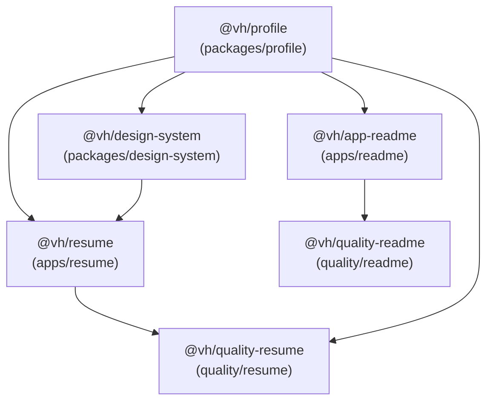
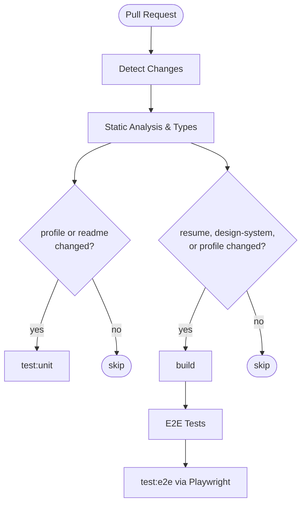
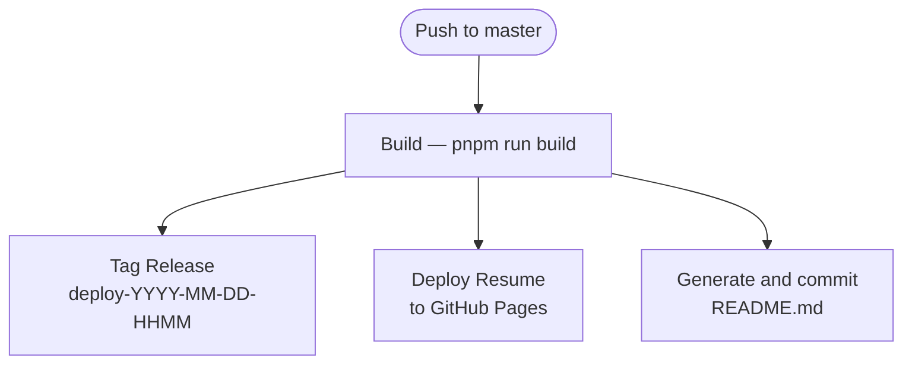

# Contributing

## Contribution Policy

This is a personal repository. Pull requests, feature requests, and external contributions
are not accepted. The repository is open source for inspection and learning — you are welcome
to read, study, and adapt ideas from it.

If you want to use this system as the foundation for your own GitHub profile monorepo, the fork guide
below explains exactly what to change and where to change it.

## What is a "Special Repo" on GitHub

GitHub displays the `README.md` of a repository whose name matches the owner's GitHub username
directly on the user's profile page. This makes the repository function as a living profile card.

This monorepo goes further than a static README file. On every push to `master`, it auto-generates
`README.md` from live GitHub API data, deploys a full resume application to GitHub Pages, and
maintains a shared Angular component library used by both outputs. The entire system is driven by a
single source of truth: the profile data in `packages/profile/`.

By forking, you inherit the complete pipeline: data → components → resume app → README generator →
GitHub Pages deployment. All six identity touchpoints described in the steps below must be updated
for the system to produce your profile instead of the original owner's.

## Fork Guide

Fork this repository on GitHub, then rename the fork so that the repository name matches your GitHub
username exactly. This is required for GitHub Pages routing and for the special-repo README behavior
to activate.

After cloning the fork locally and running `pnpm install`, work through each step below in order.
`README.md` does not appear in the steps — it is auto-generated by the CD pipeline and must not be
edited manually.

### Step 1 — Replace profile data

**File:** `packages/profile/src/profile.json`

This file is the single source of truth for the entire system. Every section of the resume
application and every dynamic section of `README.md` is generated from it.

Replace the values in each top-level key with your own information:

- `name` — your full name
- `headline` — your professional title and key technologies, shown at the top of the resume
  and in the README header
- `summary` — a paragraph-length professional summary; must not exceed 2,600 characters
- `location` — your city or region
- `links` — at least one link object is required. Each object takes a `label`, a valid `url`,
  and an optional `icon` identifier
- `experience` — your work history; at least one entry is required. Each entry takes:
  - `company` and `role` as required strings
  - `startDate` in `YYYY-MM` format (required)
  - `description` as an array of at least one string
  - `technologies` as an array of strings
  - `endDate` in `YYYY-MM` format (optional; omit for current roles)
- `education` — your academic background; can be an empty array
- `certifications` — professional certifications; can be an empty array
- `projects` — notable projects; can be an empty array. Each entry takes `name`, `description`,
  a valid `url`, and an optional `technologies` array
- `skills` — at least one skill category is required. Each entry takes a `category` name and a
  `skills` array with at least one item
- `languages` — at least one entry is required. Each entry takes a `language` name and a
  `proficiency` level

The schema is enforced at build time by the Zod definitions in `packages/profile/src/schema.ts`.
If any required field is missing or a value fails validation, the build will fail with a descriptive
error pointing to the offending field.

### Step 2 — Update root package metadata

**File:** `package.json` (root)

This file contains identity fields that reference the original repository owner. Locate and replace
each of the following:

- `name` — change `"virgenherrera"` to your GitHub username
- `author` — update the display name and the GitHub profile URL to your own
- `homepage` — update to your fork's README URL
- `bugs.url` — update to your fork's issues URL
- `repository.url` — update to your fork's git URL
- `contributors` — replace the existing entry with your own name and GitHub profile URL

### Step 3 — Configure the resume app output paths

**File:** `apps/resume/angular.json`

Two values in this file must match your GitHub username exactly:

- Under `projects.resume.architect.build.options.outputPath`, the `browser` field is set to
  `"virgenherrera"`. Change this to your GitHub username. This controls the subdirectory name
  of the build artifact that the CD pipeline uploads to GitHub Pages.
- Under `projects.resume.architect.build.configurations.production`, the `baseHref` field is set
  to `"/virgenherrera/"`. Change this to `"/<your-username>/"`, preserving both surrounding
  slashes. GitHub Pages serves your site at `https://<your-username>.github.io/<your-username>/`,
  so the base href must match the repository name exactly.

### Step 4 — Update the HTTP client identifier

**File:** `apps/readme/src/app.module.ts`

The NestJS application that generates `README.md` makes HTTP requests to the GitHub API. It
identifies itself with a `User-Agent` header currently set to `'virgenherrera-cli'`. This value
appears inside the `HttpModule.register()` call under the `headers` object.

Change `'virgenherrera-cli'` to an identifier that represents your fork — conventionally your
GitHub username followed by `-cli`.

### Step 5 — Update the CD pipeline artifact path

**File:** `.github/workflows/cd.yml`

In the Build job, the step named "Upload resume artifact" passes a `path` parameter set to
`artifacts/resume/virgenherrera`. Change `virgenherrera` in that path to your GitHub username.

This value must match the `browser` output path set in Step 3 — both reference the same build
artifact directory by name.

### Step 6 — Update the Playwright base path constant

**File:** `quality/resume/src/constants/base-path.constant.ts`

The end-to-end test suite constructs request URLs using a `BASE_PATH` constant currently set to
`'/virgenherrera'`. Change this string to `'/<your-username>'`.

This value must match the `baseHref` set in Step 3, without the trailing slash.

## Verification

After completing all six steps, run the following commands from the repository root:

```bash
pnpm install
pnpm test:static
pnpm test:types
pnpm run serve:resume
```

`pnpm test:static` runs ESLint and Prettier checks across all workspaces. `pnpm test:types` runs
TypeScript type checking, which includes Zod schema validation of your profile data. If either
command fails, the error output will point to the file and field that needs attention.

After `pnpm run serve:resume` starts, open `http://localhost:4200` in a browser. The resume
application should render your profile data — your name, headline, and professional history from
`packages/profile/src/profile.json`. If the page loads but displays the previous owner's data,
confirm that you saved the changes to `profile.json` and that `pnpm install` completed without
errors.

Once the local preview matches your expectations, push to `master`. The CD pipeline will build the
resume, deploy it to GitHub Pages, and regenerate `README.md` automatically.

---

## Technical Reference

The sections below are the architectural reference for the monorepo, preserved from the Developer
Guide for those who want to understand how the system is built.

### Workspace Map

| Name                 | Path                      | Description                                                           | README                                                               |
| -------------------- | ------------------------- | --------------------------------------------------------------------- | -------------------------------------------------------------------- |
| `@vh/resume`         | `apps/resume/`            | Angular SSR resume application — deployed to GitHub Pages             | [apps/resume/README.md](apps/resume/README.md)                       |
| `@vh/app-readme`     | `apps/readme/`            | NestJS script that generates the root `README.md` from the GitHub API | [apps/readme/README.md](apps/readme/README.md)                       |
| `@vh/profile`        | `packages/profile/`       | TypeScript data library — profile schemas, types, and raw data        | [packages/profile/README.md](packages/profile/README.md)             |
| `@vh/design-system`  | `packages/design-system/` | Angular component library with Storybook                              | [packages/design-system/README.md](packages/design-system/README.md) |
| `@vh/quality-resume` | `quality/resume/`         | Playwright e2e test suite for `apps/resume`                           | [quality/resume/README.md](quality/resume/README.md)                 |
| `@vh/quality-readme` | `quality/readme/`         | Jest integration test suite for `apps/readme`                         | [quality/readme/README.md](quality/readme/README.md)                 |

### Dependency Graph



`packages/profile` is the foundation — every other workspace depends on it directly or
transitively.

### Root Scripts

See the `scripts` field in [`package.json`](package.json) for all available commands. Each workspace
exposes its own subset — see [docs/quality-gates.md](docs/quality-gates.md) for the full echo
matrix.

### Quality Gates

Every atomic script defined in `package.json` is reused under the identical name across all
execution contexts: local development, lint-staged, pre-commit, pre-push, CI, and dependency bumps.
No per-context aliases. No inline tool invocations. Root scripts delegate to workspaces via
`pnpm -r run --if-present <name>` — workspaces opt in by exposing the matching script.

This is the Echo Principle: if a script's command changes in any workspace, every context inherits
that change automatically without touching hook files or CI workflows.

See [docs/quality-gates.md](docs/quality-gates.md) for the full script taxonomy, workspace echo
matrix, pipeline order contract, tier split rationale, and pipeline diagrams.

### Branching Model

```mermaid
gitGraph
    commit id: "master"
    branch feature/epic
    checkout feature/epic
    branch task/name
    checkout task/name
    commit id: "work"
    checkout feature/epic
    merge task/name id: "merge task"
    checkout master
    merge feature/epic id: "PR merged"
```

| Branch type      | Pattern               | Purpose                                    |
| ---------------- | --------------------- | ------------------------------------------ |
| Task branch      | `task/{name}`         | One per agent or work unit — smallest unit |
| Epic branch      | `feature/{epic-name}` | Collects all task merges for a feature     |
| Integration → PR | feature → master      | Squash-merge via pull request              |

There is no "too small" exemption. A one-line fix follows the same branching model as a 50-file
epic. The model exists for auditability and rollback safety.

See [AGENTS.md](AGENTS.md) for the full branching protocol, handoff requirements, and
anti-rationalization rules.

### CI/CD Pipeline

#### Continuous Integration (pull requests)

Triggered on every pull request targeting `master`. Path filters detect which workspaces changed
and skip unnecessary jobs.



`test:static` and `test:types` always run regardless of path filters.

#### Continuous Deployment (push to master)

Triggered on every push to `master`. All jobs run after the build completes.



`tag`, `deploy-resume`, and `deploy-readme` run in parallel after `build` succeeds. The
`deploy-readme` job commits the regenerated `README.md` back to `master` with `[skip ci]` to
prevent a pipeline loop.
