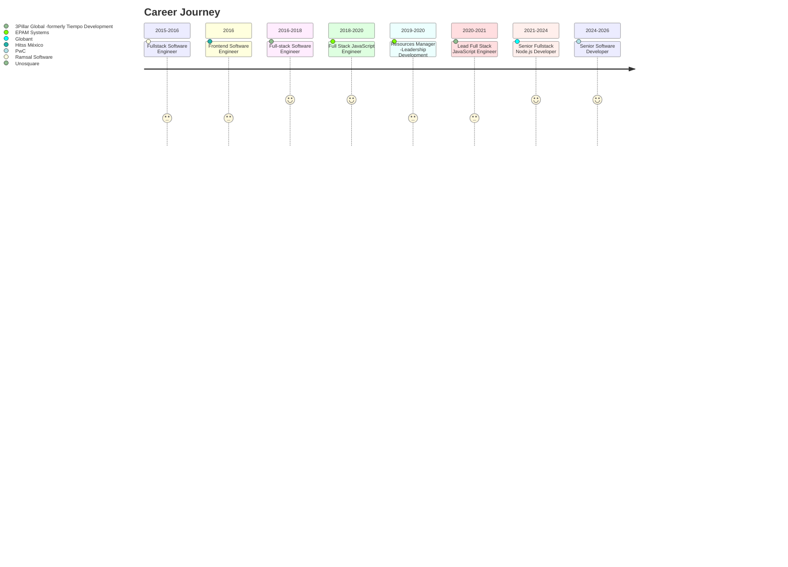
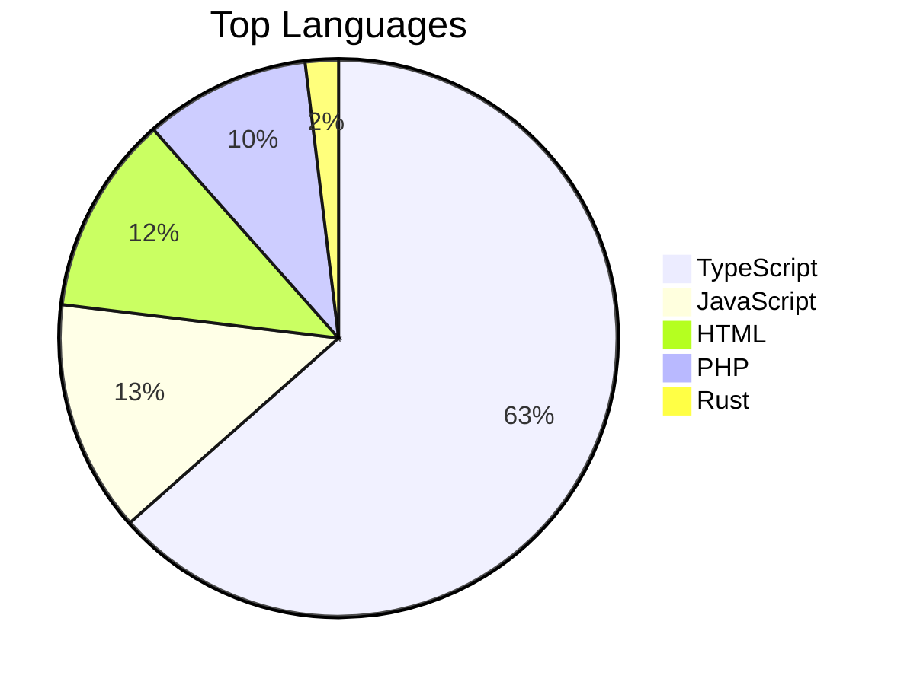

**Senior Fullstack Engineer | Design Systems | AI Integrations | Cloud | Node.js | TypeScript | C# | Angular | .NET**

---

&nbsp;
&nbsp;
&nbsp;
&nbsp;
&nbsp;
&nbsp;
&nbsp;

---

## 👤 About

> Senior Fullstack Engineer with 10+ years of hands-on experience in JavaScript and TypeScript, specializing in building scalable, high-performance web and backend applications using Node.js. Strong background in designing cloud-native systems with a focus on performance, maintainability, and clean architecture. Experienced in AI-powered integrations using LangChain and OpenAI APIs, building conversational platforms that unify isolated enterprise systems.

**Spoken Languages:**&nbsp;
&nbsp;

---

---

## 🛠️ Skills

| | Category | Technologies |
|:---:|:---|:---|
| 💬 | **Languages** | JavaScript, TypeScript, C#, PHP |
| ⚙️ | **Backend Frameworks** | Node.js, NestJS, Express.js, .NET, .NET Framework |
| 🎨 | **Frontend Frameworks** | Angular, React, Vue |
| 🗄️ | **Databases** | PostgreSQL, MySQL, MariaDB, MongoDB, DynamoDB, Redis |
| 🔌 | **APIs & Protocols** | REST, GraphQL, gRPC, WebSocket |
| ☁️ | **Cloud & DevOps** | AWS, Azure, Docker, CI/CD |
| 🗂️ | **ORMs & ODMs** | Prisma, TypeORM, Sequelize, Mongoose |
| 🤖 | **AI & Integrations** | LangChain, OpenAI API, LLM-based orchestration |
| 🧪 | **Testing & QA** | Playwright, Jest, Vitest, Mocha |
| 🏗️ | **Architecture & Patterns** | Monorepo (pnpm workspaces), Design Systems, Angular Signals, DI Multi-Provider, SSR/SSG, Clean Architecture |

---

## 🚀 Featured Projects

| Project | Description | Stars |
|:---|:---|:---:|
| [**virgenherrera**](https://github.com/virgenherrera/virgenherrera) | GitHub special profile repo: Angular {{angularVersion}} resume app (SSR/SSG) deployed to GitHub Pages, NestJS-powered profile README generator, shared design system, Playwright e2e suite, and GitHub Actions CI/CD pipelines — orchestrated with pnpm workspaces, AI-driven. |  |
| [**nest-base**](https://github.com/virgenherrera/nest-base) | Starter template for building NestJS 11 HTTP services with typed environment configuration, ready-made OpenAPI documentation, and a local test pipeline that mirrors CI workflows. |  |
| [**lan-file-share**](https://github.com/virgenherrera/lan-file-share) | Application for sharing files across devices on the same Local Area Network via HTTP, featuring a NestJS backend and Angular frontend with QR code connectivity for mobile devices. |  |
| [**typescript-base**](https://github.com/virgenherrera/typescript-base) | Starter template for TypeScript projects with ESLint, Prettier, Jest, and VS Code configurations for Node.js development. |  |
| [**tl-assistant**](https://github.com/virgenherrera/tl-assistant) | TypeScript-based assistant application built with NestJS, featuring agent-based functionality and spec-driven development conventions. |  |

---

## 💻 Top Languages

---

## 📈 GitHub Stats

| Metric | Value |
|:---|:---:|
| Public Repos | 62 |
| Total Stars | ⭐ 5 |
| Total Forks | 🍴 5 |

---

## 🤝 Let's Connect

&nbsp;
&nbsp;

---

## 🧑‍💻 For Developers

This README is auto-generated by a NestJS app on every push to `main`.
Looking for architecture details, local setup, or contribution guidelines?

**[Developer Hub → CONTRIBUTING.md](CONTRIBUTING.md)**

---

*Generated by [virgenherrera](https://github.com/virgenherrera/virgenherrera)*

