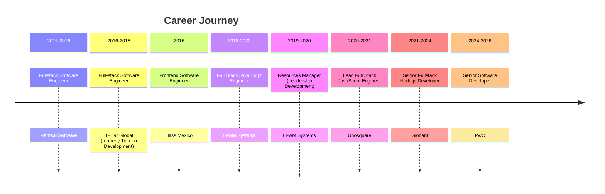
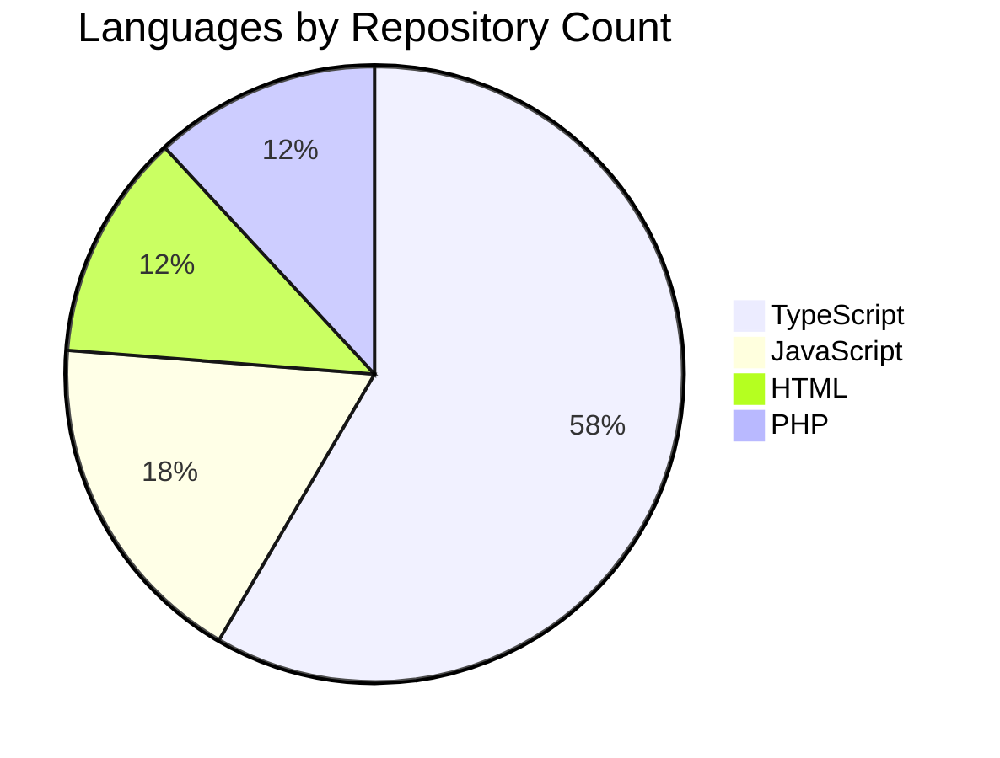

# Hugo Enrique Virgen Herrera

**Senior Fullstack Engineer | Node.js | JavaScript | TypeScript | C# | .NET | Cloud | AI Integrations** | Mexico

## About

Senior Fullstack Engineer with 10+ years of hands-on experience in JavaScript and TypeScript, specializing in building scalable, high-performance web and backend applications using Node.js. Strong background in designing cloud-native systems with a focus on performance, maintainability, and clean architecture.

## Featured Projects

- [**typescript-base**](https://github.com/virgenherrera/typescript-base) — No description `TypeScript` ⭐ 2
- [**nest-base**](https://github.com/virgenherrera/nest-base) — No description `TypeScript` ⭐ 1
- [**lan-file-share**](https://github.com/virgenherrera/lan-file-share) — No description `TypeScript` ⭐ 1
- [**enhanced-loan-challenge**](https://github.com/virgenherrera/enhanced-loan-challenge) — No description `TypeScript` ⭐ 1
- [**omnimodel_CI3**](https://github.com/virgenherrera/omnimodel_CI3) — Este modelo es útel si deseas hacer consultas tipo array usando la clase Active Record de codeigniter3 `PHP` ⭐ 1

## Let's Connect

[GitHub](https://github.com/virgenherrera) | [LinkedIn](https://www.linkedin.com/in/virgenherrera) | [Portfolio](https://virgenherrera.github.io/virgenherrera)

---

*Generated by [virgenherrera](https://github.com/virgenherrera/virgenherrera) · [Developer Guide](README-DEV.md)*
