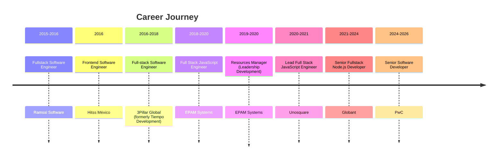
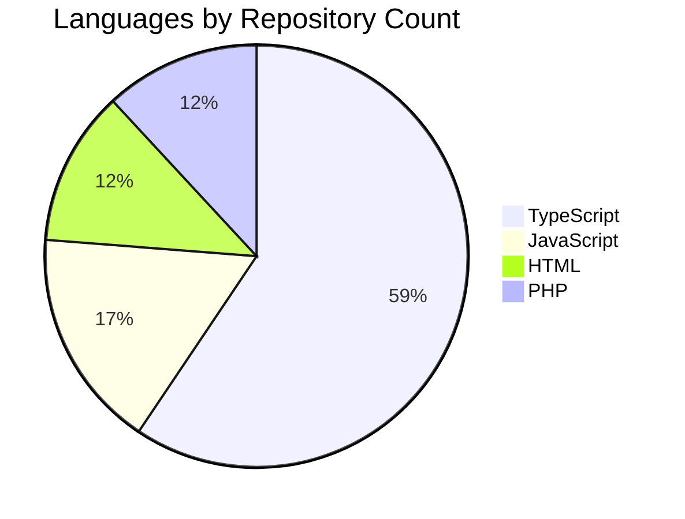

# Hugo Enrique Virgen Herrera

**Senior Fullstack Engineer | Node.js | JavaScript | TypeScript | C# | .NET | Cloud | AI Integrations** | Mexico

       

## About

Senior Fullstack Engineer with 10+ years of hands-on experience in JavaScript and TypeScript, specializing in building scalable, high-performance web and backend applications using Node.js. Strong background in designing cloud-native systems with a focus on performance, maintainability, and clean architecture. Experienced in AI-powered integrations using LangChain and OpenAI APIs, building conversational platforms that unify isolated enterprise systems. Proven experience with Node.js orchestration and Azure-based serverless architectures, including Azure Functions and CI/CD pipelines. Skilled in microservices architectures, integrating Node.js and .NET services to handle data-intensive workloads, optimize performance, and maintain conversational context across distributed systems.

## Skills

| Category | Technologies |
| --- | --- |
| **Languages** | JavaScript, TypeScript, C#, PHP |
| **Backend Frameworks** | Node.js, NestJS, Express.js, .NET, .NET Framework |
| **Frontend Frameworks** | Angular, React, Vue |
| **Databases** | PostgreSQL, MySQL, MariaDB, MongoDB, DynamoDB, Redis |
| **APIs & Protocols** | REST, GraphQL, gRPC, WebSocket |
| **Cloud & DevOps** | AWS, Azure, Docker, CI/CD |
| **ORMs & ODMs** | Prisma, TypeORM, Sequelize, Mongoose |
| **AI & Integrations** | LangChain, OpenAI API, LLM-based orchestration |

## Featured Projects

| Project | Description |
| --- | --- |
| [**omnimodel_CI3**](https://github.com/virgenherrera/omnimodel_CI3) | Este modelo es útel si deseas hacer consultas tipo array usando la clase Active Record de codeigniter3 `PHP` ⭐ 1 |

## Let's Connect

[GitHub](https://github.com/virgenherrera) | [LinkedIn](https://www.linkedin.com/in/virgenherrera) | [Portfolio](https://virgenherrera.github.io/virgenherrera)

---

*Generated by [virgenherrera](https://github.com/virgenherrera/virgenherrera) · [Developer Guide](README-DEV.md)*
