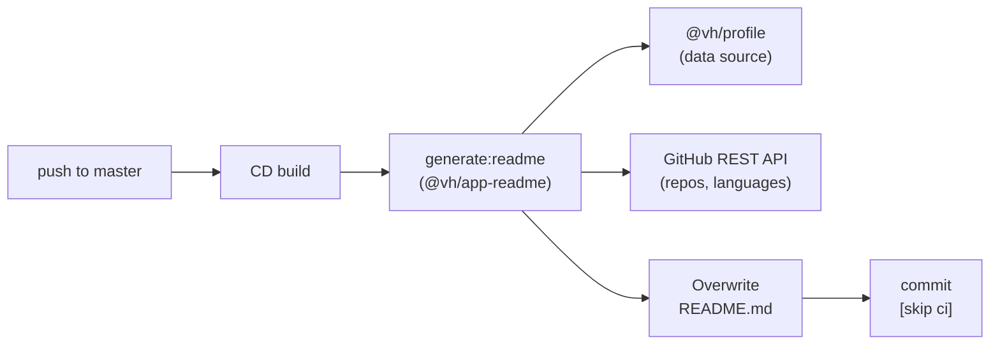

> [← Developer Hub](../../CONTRIBUTING.md)

# @vh/app-readme

## Menú

- [Overview](#overview)
- [Tech Stack](#tech-stack)
- [Usage](#usage)
- [Scripts](#scripts)
- [Workspace Dependencies](#workspace-dependencies)
- [Pipeline Integration](#pipeline-integration)

---

## Overview

NestJS CLI script that auto-generates the root `README.md` from `@vh/profile` data and the GitHub REST API. It runs as a step in the CD pipeline, committing the updated file with a `[skip ci]` tag to avoid a build loop.

[↑ Menú](#menú)

---

## Tech Stack

- **NestJS** — DI-based application structure (`AppModule`, services)
- **ts-node** — runs the script directly without a compilation step
- **GitHub REST API** — fetches repository metadata (languages, repos, pinned items)
- **Zod** — validates GitHub API response schemas

[↑ Menú](#menú)

---

## Usage

Run from the monorepo root:

```bash
pnpm run generate:readme
```

This executes the NestJS bootstrap script, fetches live data from GitHub, and **overwrites** the root `README.md`. The file is not committed automatically when run locally — that step is handled by the CD pipeline.

[↑ Menú](#menú)

---

## Scripts

Run from `apps/readme/` or prefix with `--filter @vh/app-readme` at the monorepo root.

| Script | Description |
| --- | --- |
| `start` | Execute the generator via `ts-node` |
| `test:doctor` | Run all quality gates: static analysis and types |
| `test:static` | ESLint + Prettier checks |
| `test:types` | TypeScript type-check without emitting (`tsc --noEmit`) |
| `eslintCheck` | Lint source files |
| `eslintFix` | Lint source files and auto-fix |
| `prettierCheck` | Check formatting for `src/**/*.ts` |
| `prettierFix` | Auto-format source files |
| `cleanup` | No-op (no build artifacts produced) |

[↑ Menú](#menú)

---

## Workspace Dependencies

| Package | README |
| --- | --- |
| `@vh/profile` | [packages/profile/README.md](../../packages/profile/README.md) |

[↑ Menú](#menú)

---

## Pipeline Integration

On every push to `master`, the CD pipeline regenerates the root `README.md` and commits the result with `[skip ci]` to prevent an infinite build loop.



[↑ Menú](#menú)
