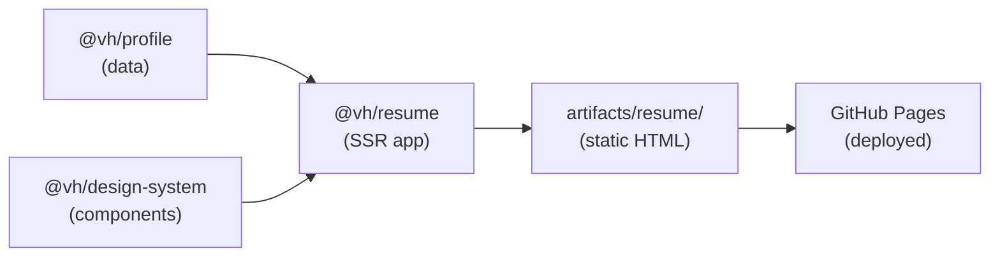

> [← Developer Hub](../../CONTRIBUTING.md)

# @vh/resume

## Menú

- [Overview](#overview)
- [Tech Stack](#tech-stack)
- [Local Development](#local-development)
- [Scripts](#scripts)
- [Workspace Dependencies](#workspace-dependencies)
- [Architecture](#architecture)

---

## Overview

Angular SSR resume application that pre-renders to static HTML and deploys to GitHub Pages. It supports a public view (read-only) and a private view (unlocked via URL hash) that includes a PDF download powered by jsPDF.

[↑ Menú](#menú)

---

## Tech Stack

- **Angular** (version pinned in root catalog — see `pnpm-workspace.yaml`)
- **@angular/ssr** — static pre-rendering (`outputMode: static`)
- **Tailwind CSS** — utility-first styling
- **jsPDF** — client-side PDF generation for the private view
- **Deployed to GitHub Pages** via the CD pipeline

[↑ Menú](#menú)

---

## Local Development

Run from the monorepo root:

```bash
pnpm run serve:resume
```

[↑ Menú](#menú)

---

## Scripts

Run from `apps/resume/` or prefix with `--filter @vh/resume` at the monorepo root.

| Script | Description |
| --- | --- |
| `start` | Serve locally with Angular CLI (`ng serve`) |
| `watch` | Build in watch mode (development configuration) |
| `build` | Production build (SSR + static pre-rendering) |
| `test:doctor` | Run all quality gates: static analysis, types, and build |
| `test:static` | ESLint + Prettier checks |
| `test:types` | TypeScript type-check without emitting (`tsc --noEmit`) |
| `eslintCheck` | Lint source files |
| `eslintFix` | Lint source files and auto-fix |
| `ng` | Direct Angular CLI passthrough |
| `prettierCheck` | Check formatting for `src/**/*.ts` |
| `prettierFix` | Auto-format source files |
| `cleanup` | Delete `.angular` cache directory |

[↑ Menú](#menú)

---

## Workspace Dependencies

| Package | README |
| --- | --- |
| `@vh/profile` | [packages/profile/README.md](../../packages/profile/README.md) |
| `@vh/design-system` | [packages/design-system/README.md](../../packages/design-system/README.md) |

[↑ Menú](#menú)

---

## Architecture

Data flows from the profile library through the design system into the SSR build, which is deployed as static HTML to GitHub Pages.



[↑ Menú](#menú)
