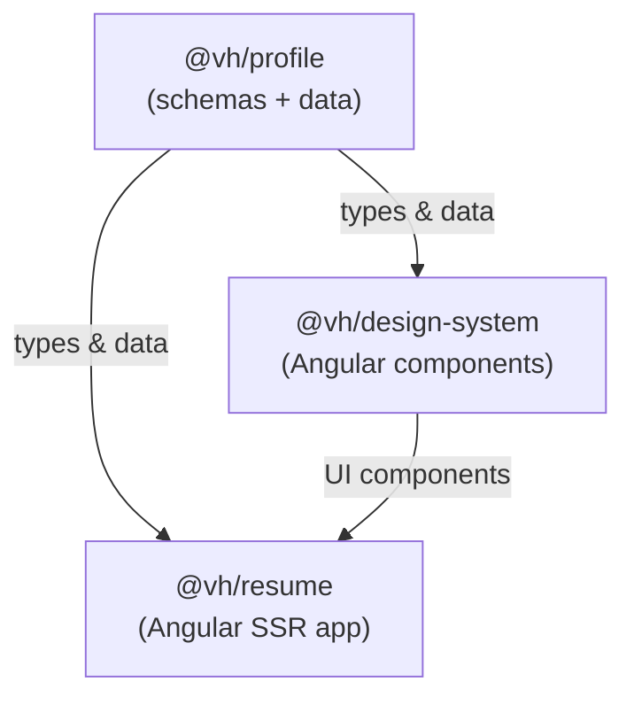

> [← Developer Hub](../../CONTRIBUTING.md)

# @vh/design-system

## Menú

- [Overview](#overview)
- [Components](#components)
- [Storybook](#storybook)
- [Consumers](#consumers)
- [Workspace Dependencies](#workspace-dependencies)
- [Scripts](#scripts)
- [Architecture](#architecture)

---

## Overview

Angular component library with Storybook that provides reusable UI components for the resume application. Components are standalone, use Tailwind CSS for styling, and are documented with interactive Storybook stories.

[↑ Menú](#menú)

---

## Components

Launch [Storybook](#storybook) for the interactive component catalog with live examples and documentation.

For the full list of exported components, directives, and pipes, see [`src/index.ts`](src/index.ts).

[↑ Menú](#menú)

---

## Storybook

Launch the interactive component explorer:

```bash
# From monorepo root
pnpm run storybook

# From this workspace
pnpm run storybook
```

Build a static Storybook site:

```bash
# From monorepo root
pnpm run build:storybook

# From this workspace
pnpm run build:storybook
```

Static output is written to `storybook-static/`. Run `pnpm run cleanup` to remove it.

[↑ Menú](#menú)

---

## Consumers

See the dependency graph in [CONTRIBUTING.md](../../CONTRIBUTING.md) for the full list of workspaces that consume this package.

[↑ Menú](#menú)

---

## Workspace Dependencies

| Workspace     | README                                             |
| ------------- | -------------------------------------------------- |
| `@vh/profile` | [packages/profile/README.md](../profile/README.md) |

[↑ Menú](#menú)

---

## Scripts

See [`package.json`](package.json) for available scripts. Echo scripts follow the [quality gates convention](../../docs/quality-gates.md).

[↑ Menú](#menú)

---

## Architecture



`@vh/profile` provides the data contracts. `@vh/design-system` consumes those types to render strongly-typed UI components. `@vh/resume` composes both layers into the deployed application.

[↑ Menú](#menú)
