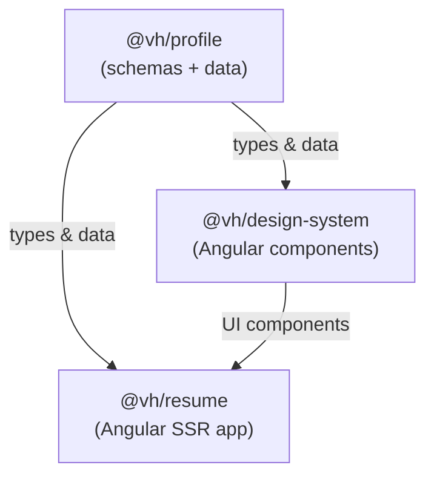

> [← Developer Hub](../../CONTRIBUTING.md)

# @vh/design-system

## Menú

- [Overview](#overview)
- [Components](#components)
- [Storybook](#storybook)
- [Consumers](#consumers)
- [Workspace Dependencies](#workspace-dependencies)
- [Scripts](#scripts)
- [Architecture](#architecture)

---

## Overview

Angular component library with Storybook that provides reusable UI components for the resume application. Components are standalone, use Tailwind CSS for styling, and are documented with interactive Storybook stories.

[↑ Menú](#menú)

---

## Components

### UI Components

| Component | Selector | Description |
| --- | --- | --- |
| `AvatarComponent` | `vh-avatar` | Profile photo with configurable size variants |
| `ContactLinkComponent` | `vh-contact-link` | Styled link for contact information entries |
| `EducationItemComponent` | `vh-education-item` | Single education record with degree, institution, and dates |
| `ExperienceItemComponent` | `vh-experience-item` | Single work experience entry with compact and full display variants |
| `ExperienceListComponent` | `vh-experience-list` | Ordered list of experience items |
| `FileActionComponent` | `vh-file-action` | Button or link for file download/print actions |
| `IconComponent` | `vh-icon` | SVG icon renderer using built-in icon path constants |
| `JumbotronComponent` | `vh-jumbotron` | Full-width hero section for the top of the resume |
| `LanguageBadgeComponent` | `vh-language-badge` | Badge displaying a language and its proficiency level |
| `ParticleCanvasComponent` | `vh-particle-canvas` | Animated particle background canvas |
| `ProfileSidebarComponent` | `vh-profile-sidebar` | Sidebar layout with contact links and summary |
| `ProjectListComponent` | `vh-project-list` | Grid or list of personal project cards |
| `SkillGroupComponent` | `vh-skill-group` | Grouped skill category with tag list |
| `TagComponent` | `vh-tag` | Pill-shaped label with size and variant options |
| `ThemeToggleComponent` | `vh-theme-toggle` | Dark/light mode toggle button |
| `TypewriterComponent` | `vh-typewriter` | Animated typewriter text effect |

### Directives & Pipes

| Export | Selector | Description |
| --- | --- | --- |
| `ScrollRevealDirective` | `[vhScrollReveal]` | Reveals element when it enters the viewport |
| `StickyScrollDirective` | `[vhStickyScroll]` | Applies sticky positioning based on scroll position |
| `FormatDatePipe` | — | Formats `YYYY-MM` strings into human-readable date labels |

[↑ Menú](#menú)

---

## Storybook

Launch the interactive component explorer:

```bash
# From monorepo root
pnpm run storybook

# From this workspace
pnpm run storybook
```

Build a static Storybook site:

```bash
# From monorepo root
pnpm run build:storybook

# From this workspace
pnpm run build:storybook
```

Static output is written to `storybook-static/`. Run `pnpm run cleanup` to remove it.

[↑ Menú](#menú)

---

## Consumers

| Workspace | README |
| --- | --- |
| `@vh/resume` | [apps/resume/README.md](../../apps/resume/README.md) |

[↑ Menú](#menú)

---

## Workspace Dependencies

| Workspace | README |
| --- | --- |
| `@vh/profile` | [packages/profile/README.md](../profile/README.md) |

[↑ Menú](#menú)

---

## Scripts

| Script | Command | Description |
| --- | --- | --- |
| `storybook` | `pnpm run storybook` | Launch Storybook dev server |
| `build:storybook` | `pnpm run build:storybook` | Build static Storybook site |
| `test:doctor` | `pnpm run test:doctor` | Full quality check: static + types |
| `test:static` | `pnpm run test:static` | ESLint + Prettier format check |
| `test:types` | `pnpm run test:types` | TypeScript type check with `tsc --noEmit` |
| `eslintCheck` | `pnpm run eslintCheck` | Run ESLint in check mode |
| `eslintFix` | `pnpm run eslintFix` | Run ESLint with auto-fix |
| `prettierCheck` | `pnpm run prettierCheck` | Check formatting on `src/**/*.ts` |
| `prettierFix` | `pnpm run prettierFix` | Apply Prettier formatting |
| `cleanup` | `pnpm run cleanup` | Remove `artifacts/` and `storybook-static/` |

[↑ Menú](#menú)

---

## Architecture



`@vh/profile` provides the data contracts. `@vh/design-system` consumes those types to render strongly-typed UI components. `@vh/resume` composes both layers into the deployed application.

[↑ Menú](#menú)
