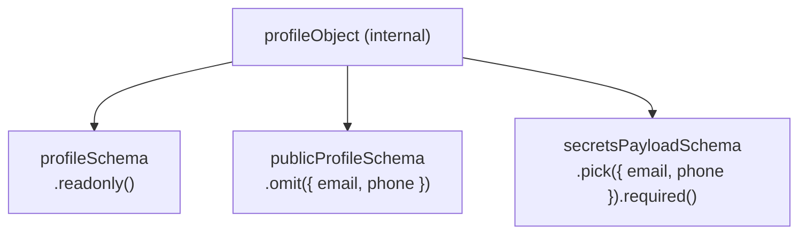
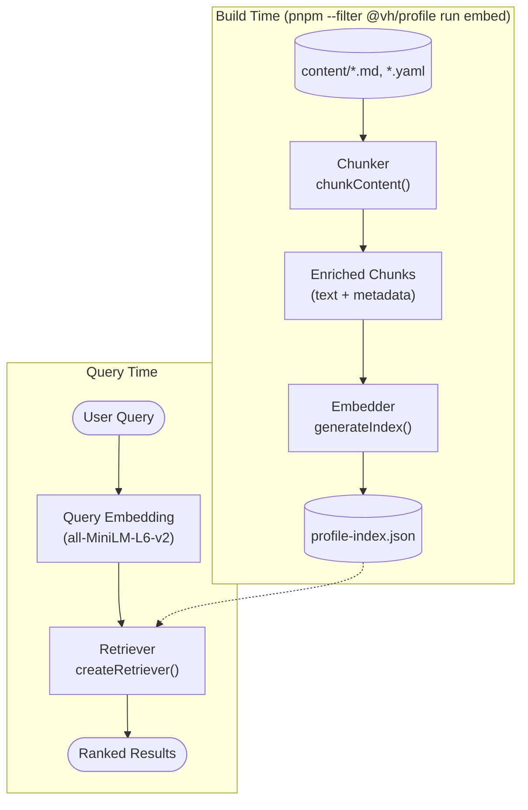

> [← Developer Hub](../../CONTRIBUTING.md)

# @vh/profile

## Menú

- [Overview](#overview)
- [Exports](#exports)
- [Schema Architecture](#schema-architecture)
- [Consumers](#consumers)
- [RAG Pipeline](#rag-pipeline)
- [Scripts](#scripts)
- [Testing](#testing)

---

## Overview

TypeScript data library that is the single source of truth for all personal and professional profile data in the monorepo. Exports Zod schemas with full type inference, frozen runtime data objects, and a utility for parsing structured description blocks.

[↑ Menú](#menú)

---

## Exports

See [`src/index.ts`](src/index.ts) for the full list of exported schemas, types, and data objects. All exports are available from `'@vh/profile'`.

[↑ Menú](#menú)

---

## Schema Architecture

`profileObject` is the internal base Zod object. All exported schemas are derived from it — none duplicate field definitions.



- **`profileSchema`** — full profile, all fields readonly.
- **`publicProfileSchema`** — omits `email` and `phone`; used for public data.
- **`secretsPayloadSchema`** — picks only `email` and `phone`, both required; used for the secrets API route.

[↑ Menú](#menú)

---

## Consumers

See the dependency graph in [CONTRIBUTING.md](../../CONTRIBUTING.md) for the full list of workspaces that consume this package.

[↑ Menú](#menú)

---

## RAG Pipeline

This package includes a small Retrieval-Augmented Generation (RAG) pipeline that turns the raw
content in `content/` into a searchable, embedding-based index. It exists so consumers (like an
AI-powered chat or search feature) can retrieve the most relevant pieces of profile data for a
given query instead of shipping the entire profile as context.



### Components

| Component            | File                                                      | Responsibility                                                                                                                                                                                                                                                                                                                                                                                                                                                                              |
| -------------------- | --------------------------------------------------------- | ------------------------------------------------------------------------------------------------------------------------------------------------------------------------------------------------------------------------------------------------------------------------------------------------------------------------------------------------------------------------------------------------------------------------------------------------------------------------------------------- |
| Chunker              | [`src/rag/chunker.ts`](src/rag/chunker.ts)                | Reads `content/` directly (`meta.md`, `experience/*.md`, `education/*.md`, `projects.yaml`) and splits it into chunks of at most 500 characters, grouping whole lines so a chunk boundary never lands mid-sentence. Each chunk is enriched with a bracketed `[Skills: ...]` / `[Context: ...]` prefix before embedding, and carries `ChunkMetadata` (`source`, `type`, `skills`, `company`, `role`, `startDate`, `endDate`) that the retriever later uses for boosting and graph expansion. |
| Embedder             | [`src/rag/embedder.ts`](src/rag/embedder.ts)              | Loads the `all-MiniLM-L6-v2` model (384 dimensions) via `@huggingface/transformers`, generates a mean-pooled, normalized embedding for every chunk, and writes the chunks plus a serialized profile graph (skill-to-experience/project relationships) to `profile-index.json`. This module is never imported by app code — it is a build-time-only script, since the model download and its dependency must not reach the browser-safe export surface.                                      |
| Retriever            | [`src/rag/retriever.ts`](src/rag/retriever.ts)            | Given a query embedding, ranks every chunk in the loaded index through a 3-step pipeline: (1) a metadata boost for chunks whose skills or company match the query text or an explicit skill filter, (2) cosine similarity against each chunk's embedding, (3) an optional 1-hop graph expansion that pulls in sibling experiences/projects connected through shared skills, always scored below the weakest direct hit so expansions only supplement — never outrank — real matches.        |
| `profile-index.json` | `profile-index.json` (generated, not committed as source) | The build artifact consumed at query time. Holds a `version`, `generatedAt` timestamp, the `model` name, `dimensions` (384), the array of `chunks` (`id`, `text`, `metadata`, `embedding`), and the serialized `graph` (`bySkill`, `byExperience`, `byProject`) used for graph expansion.                                                                                                                                                                                                   |

### Regenerating the index

Run the following command whenever files under `content/` are added, edited, or removed:

```bash
pnpm --filter @vh/profile run embed
```

The first run downloads the `all-MiniLM-L6-v2` model (~45MB) locally; subsequent runs reuse the
cached model. The command overwrites `profile-index.json` with a fresh set of chunks and
embeddings that reflect the current content.

[↑ Menú](#menú)

---

## Scripts

See [`package.json`](package.json) for available scripts. Echo scripts follow the [quality gates convention](../../docs/quality-gates.md).

[↑ Menú](#menú)

---

## Testing

Jest unit tests validate schema contracts — parsing valid data succeeds and invalid data produces typed errors. See [`package.json`](package.json) for available test scripts.

[↑ Menú](#menú)
