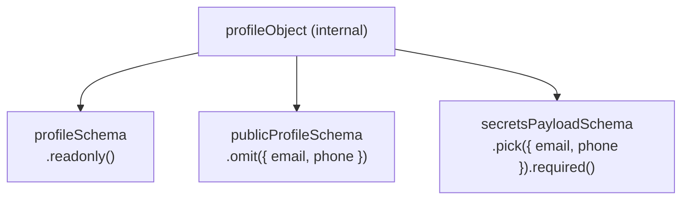

> [← Developer Hub](../../CONTRIBUTING.md)

# @vh/profile

## Menú

- [Overview](#overview)
- [Exports](#exports)
- [Schema Architecture](#schema-architecture)
- [Consumers](#consumers)
- [Scripts](#scripts)
- [Testing](#testing)

---

## Overview

TypeScript data library that is the single source of truth for all personal and professional profile data in the monorepo. Exports Zod schemas with full type inference, frozen runtime data objects, and a utility for parsing structured description blocks.

[↑ Menú](#menú)

---

## Exports

### Schemas

| Export                 | Import path                                          |
| ---------------------- | ---------------------------------------------------- |
| `profileSchema`        | `import { profileSchema } from '@vh/profile'`        |
| `linkSchema`           | `import { linkSchema } from '@vh/profile'`           |
| `experienceSchema`     | `import { experienceSchema } from '@vh/profile'`     |
| `educationSchema`      | `import { educationSchema } from '@vh/profile'`      |
| `certificationSchema`  | `import { certificationSchema } from '@vh/profile'`  |
| `skillCategorySchema`  | `import { skillCategorySchema } from '@vh/profile'`  |
| `projectSchema`        | `import { projectSchema } from '@vh/profile'`        |
| `languageSchema`       | `import { languageSchema } from '@vh/profile'`       |
| `secretsPayloadSchema` | `import { secretsPayloadSchema } from '@vh/profile'` |

### Types

| Export              | Import path                                            |
| ------------------- | ------------------------------------------------------ |
| `ProfileData`       | `import type { ProfileData } from '@vh/profile'`       |
| `PublicProfileData` | `import type { PublicProfileData } from '@vh/profile'` |
| `SecretsPayload`    | `import type { SecretsPayload } from '@vh/profile'`    |
| `LinkData`          | `import type { LinkData } from '@vh/profile'`          |
| `ExperienceData`    | `import type { ExperienceData } from '@vh/profile'`    |
| `EducationData`     | `import type { EducationData } from '@vh/profile'`     |
| `CertificationData` | `import type { CertificationData } from '@vh/profile'` |
| `SkillCategoryData` | `import type { SkillCategoryData } from '@vh/profile'` |
| `ProjectData`       | `import type { ProjectData } from '@vh/profile'`       |
| `LanguageData`      | `import type { LanguageData } from '@vh/profile'`      |

### Data & Utilities

| Export             | Import path                                           | Description                                                    |
| ------------------ | ----------------------------------------------------- | -------------------------------------------------------------- |
| `PUBLIC_PROFILE`   | `import { PUBLIC_PROFILE } from '@vh/profile'`        | Frozen parsed object without private contact fields            |
| `PRIVATE_PROFILE`  | `import { PRIVATE_PROFILE } from '@vh/profile'`       | Frozen parsed object with all fields including email and phone |
| `parseDescription` | `import { parseDescription } from '@vh/profile'`      | Parses raw string arrays into structured `DescriptionBlock[]`  |
| `DescriptionBlock` | `import type { DescriptionBlock } from '@vh/profile'` | Type for a parsed description entry                            |

[↑ Menú](#menú)

---

## Schema Architecture

`profileObject` is the internal base Zod object. All exported schemas are derived from it — none duplicate field definitions.



- **`profileSchema`** — full profile, all fields readonly.
- **`publicProfileSchema`** — omits `email` and `phone`; used for public data.
- **`secretsPayloadSchema`** — picks only `email` and `phone`, both required; used for the secrets API route.

[↑ Menú](#menú)

---

## Consumers

| Workspace            | README                                                         |
| -------------------- | -------------------------------------------------------------- |
| `@vh/resume`         | [apps/resume/README.md](../../apps/resume/README.md)           |
| `@vh/app-readme`     | [apps/readme/README.md](../../apps/readme/README.md)           |
| `@vh/design-system`  | [packages/design-system/README.md](../design-system/README.md) |
| `@vh/quality-resume` | [quality/resume/README.md](../../quality/resume/README.md)     |

[↑ Menú](#menú)

---

## Scripts

See [`package.json`](package.json) for available scripts. Echo scripts follow the [quality gates convention](../../docs/quality-gates.md).

[↑ Menú](#menú)

---

## Testing

Jest unit tests validate schema contracts — parsing valid data succeeds and invalid data produces typed errors. Run from this workspace:

```bash
pnpm run test:unit
```

Or from the monorepo root:

```bash
pnpm --filter @vh/profile run test:unit
```

[↑ Menú](#menú)
