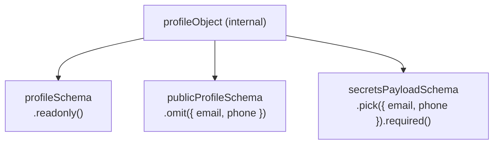

> [← Developer Hub](../../CONTRIBUTING.md)

# @vh/profile

## Menú

- [Overview](#overview)
- [Exports](#exports)
- [Schema Architecture](#schema-architecture)
- [Consumers](#consumers)
- [Scripts](#scripts)
- [Testing](#testing)

---

## Overview

TypeScript data library that is the single source of truth for all personal and professional profile data in the monorepo. Exports Zod schemas with full type inference, frozen runtime data objects, and a utility for parsing structured description blocks.

[↑ Menú](#menú)

---

## Exports

See [`src/index.ts`](src/index.ts) for the full list of exported schemas, types, and data objects. All exports are available from `'@vh/profile'`.

[↑ Menú](#menú)

---

## Schema Architecture

`profileObject` is the internal base Zod object. All exported schemas are derived from it — none duplicate field definitions.

- **`profileSchema`** — full profile, all fields readonly.
- **`publicProfileSchema`** — omits `email` and `phone`; used for public data.
- **`secretsPayloadSchema`** — picks only `email` and `phone`, both required; used for the secrets API route.

[↑ Menú](#menú)

---

## Consumers

See the dependency graph in [CONTRIBUTING.md](../../CONTRIBUTING.md) for the full list of workspaces that consume this package.

[↑ Menú](#menú)

---

## Scripts

See [`package.json`](package.json) for available scripts. Echo scripts follow the [quality gates convention](../../docs/quality-gates.md).

[↑ Menú](#menú)

---

## Testing

Jest unit tests validate schema contracts — parsing valid data succeeds and invalid data produces typed errors. See [`package.json`](package.json) for available test scripts.

[↑ Menú](#menú)
