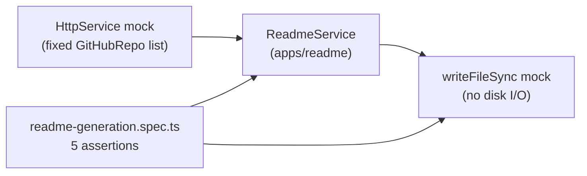

> [← Developer Hub](../../CONTRIBUTING.md)

# @vh/quality-readme

Jest integration tests validating the README generation pipeline ([`apps/readme`](../../apps/readme/README.md)). Verifies that `ReadmeService` writes a `README.md` file and that the generated content includes the expected profile data, section headings, featured projects, and language distribution chart.

## Menú

- [Test Suite](#test-suite)
- [Architecture](#architecture)
- [Running Tests](#running-tests)
- [Scripts](#scripts)
- [Workspace Dependencies](#workspace-dependencies)

---

## Test Suite

Single spec file: [`src/readme-generation.spec.ts`](src/readme-generation.spec.ts). The suite bootstraps a NestJS application context, mocks `HttpService.get` to return fixed GitHub API data, and validates that `ReadmeService.generate()` produces correct markdown output. File I/O is also mocked — no disk writes during tests.

[↑ Menú](#menú)

---

## Architecture



`NestFactory.createApplicationContext` starts the full DI graph; `HttpService.get` is spied on after the app boots so all injectable dependencies resolve normally. The mock isolation keeps tests fast and deterministic — no network calls, no file writes.

[↑ Menú](#menú)

---

## Running Tests

```bash
# From this workspace
pnpm run test:unit

# From monorepo root — delegates via --if-present
pnpm run test:unit
```

[↑ Menú](#menú)

---

## Scripts

See [`package.json`](package.json) for available scripts. Echo scripts follow the [quality gates convention](../../docs/quality-gates.md).

[↑ Menú](#menú)

---

## Workspace Dependencies

| Dependency   | Workspace                                            | Role                                    |
| ------------ | ---------------------------------------------------- | --------------------------------------- |
| Tests target | [apps/readme/README.md](../../apps/readme/README.md) | NestJS README generation app under test |

[↑ Menú](#menú)
