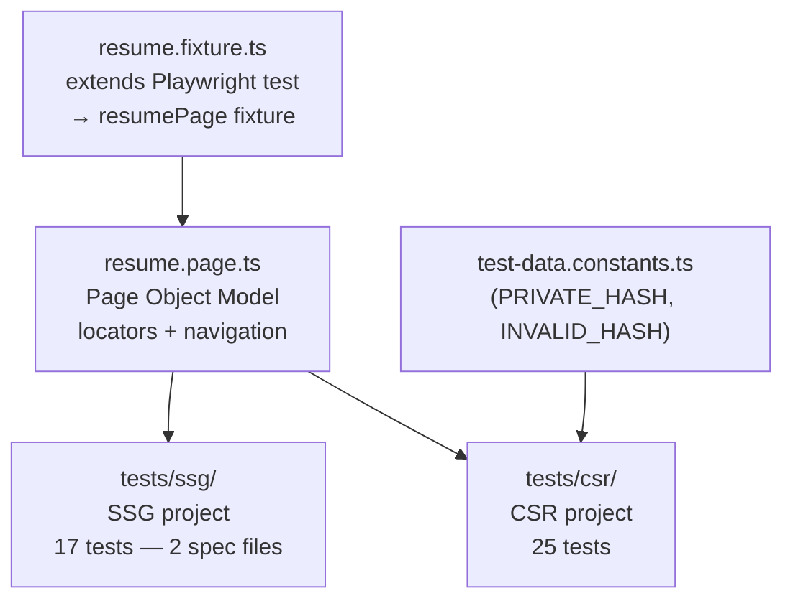

> [← Developer Hub](../../CONTRIBUTING.md)

# @vh/quality-resume

Playwright end-to-end test suite for [`apps/resume`](../../apps/resume/README.md). Covers SSG pre-rendered HTML structure, layout, and resource loading, plus CSR client-side hydration behavior including theme toggle, private-view activation, and PDF download. 42 tests across 3 spec files, organized into 2 Playwright projects.

## Menú

- [Test Suites](#test-suites)
- [Architecture](#architecture)
- [Running Tests](#running-tests)
- [Scripts](#scripts)
- [Workspace Dependencies](#workspace-dependencies)

---

## Test Suites

| Suite | Spec File | Tests | What it validates |
| ----- | --------- | ----: | ----------------- |
| SSG | `tests/ssg/resume-ssg.spec.ts` | 15 | Pre-rendered HTML structure, two-column layout, viewport dimensions, sidebar content, public/private visibility |
| SSG | `tests/ssg/resource-loading.spec.ts` | 2 | All page resources load without HTTP errors; all images render with valid dimensions |
| CSR | `tests/csr/resume-csr.spec.ts` | 25 | Client-side hydration, theme toggle (light/dark), private-view activation via URL hash, PDF download (click, keyboard, file validity) |

[↑ Menú](#menú)

---

## Architecture

Three patterns keep test logic clean and maintainable.

**Page Object Model** — `src/pages/resume.page.ts` encapsulates all locators (`jumbotron`, `sidebar`, `themeToggle`, `downloadButton`, …) and navigation helpers (`goto`, `gotoWithHash`, `waitForHydration`, `waitForPrivateView`). Tests never reference raw selectors.

**Custom Fixtures** — `src/fixtures/resume.fixture.ts` extends Playwright's `test` with a `resumePage` fixture that injects a `ResumePage` instance per test. Test files import `test` from the fixture, not from `@playwright/test` directly.

**Test Data Constants** — `src/constants/test-data.constants.ts` exports pre-computed values (`PRIVATE_HASH`, `INVALID_HASH`) typed against `SecretsPayload` from `@vh/profile`. Hashes are generated by `src/helpers/hash-encoder.ts` at module load time — no magic strings in tests.

**Expectation Descriptors** — `*.expectations.ts` files export static string classes (`SsgPreRenderExpectations`, `ClientHydrationExpectations`) that serve as human-readable test names passed directly to `test(...)`. This makes Playwright reports self-documenting.



[↑ Menú](#menú)

---

## Running Tests

Tests require build artifacts from `apps/resume`. Run `pnpm run build` at the monorepo root first.

```bash
# From this workspace — run all Playwright tests
pnpm run test:e2e

# From monorepo root — delegates via --if-present
pnpm run test:e2e

# View the HTML report after a test run
pnpm run test:report
```

The config (`src/schemas/playwright-env.schema.ts`) validates at startup that build artifacts exist and include `index.html`, a `main-*.js` bundle, and a `styles-*.css` bundle. A descriptive error message is emitted if any artifact is missing.

[↑ Menú](#menú)

---

## Scripts

| Script | Description |
| ------ | ----------- |
| `test:doctor` | Static checks + type check (`test:static` then `test:types`) |
| `test:static` | ESLint and Prettier checks |
| `test:types` | TypeScript type check (`tsc --noEmit`) |
| `test:e2e` | Run Playwright tests |
| `test:dynamic` | Alias for `test:e2e` |
| `eslintCheck` | Check ESLint rules |
| `eslintFix` | Fix ESLint issues |
| `prettierCheck` | Check Prettier formatting on `src/**/*.ts` |
| `prettierFix` | Fix Prettier formatting |
| `test:report` | Open Playwright HTML report from `artifacts/quality/resume/playwright-report` |
| `cleanup` | Remove `artifacts/quality/resume/` |

[↑ Menú](#menú)

---

## Workspace Dependencies

| Dependency | Workspace | Role |
| ---------- | --------- | ---- |
| `@vh/profile` | [packages/profile/README.md](../../packages/profile/README.md) | Provides `SecretsPayload` type used in test data constants |
| Tests target | [apps/resume/README.md](../../apps/resume/README.md) | Angular SSR resume app whose build output is served during tests |

[↑ Menú](#menú)
